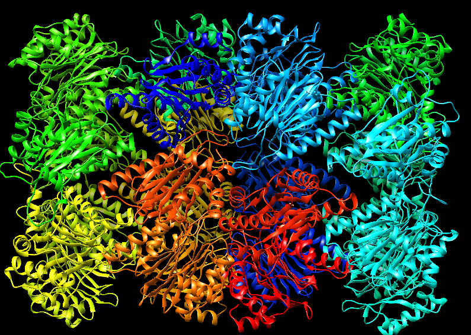

---
output:
  pdf_document: default
  html_document: default
---
#Examples analysis
On this file, we will show the assembling results of our example sets, as well as some conclusions extracted from each set

##1. Hemoglobin

{width=250px, height=250px}
{width=250px, height=250px}

+ **command**:
```
protein_assembler_main.py -v -i pdb/hemoglobin/* -o hemoglobin
```
+ **Number of input pdbs**: 3
+ **Number of unique sequences detected**: 4
+ **Number of subunits in complex**: 4
+ **Computation time**: 0.95 seconds

This is the simplest example: only four chains, made of two sequences.
Surprisingly, in this example the algorithm detects four unique seuqences instead of two. This algorithm only classifies two chains as from the same sequences if they have more than 95 identities and exactly the same residue length. Probably some input chains have lost one residue at the end when obtaining the interaction pdb files, and here this strange result.

Also, the heteroatoms of the hemo group in hemoglobin cause a lot of warnings, for biopython is not prepared to deal with heteroatoms. The fact that the chain numeration restarts at the beggingin of the heteroatom part is what causes this warnings. Nevertheless, since the final result is correct and also has the hemo groups in its chains these warning are not something to worry too much about.

##2. Proteosome

{width=250px, height=250px}
{width=250px, height=250px}

+ **command**: 
```
protein_assembler_main.py -v -o proteosome -i pdb/proteosome/*
```
+ **Number of input pdbs**: 6
+ **Number of unique sequences**: 2
+ **Number of subunits in complex**: 28
+ **Computation time**: 14.6 seconds

Since this model has way more subunits and interactions than the other, the algorithm has spend much more time for solving it.

Nevertheless, in the log messages we can see that the last interactions checked have not given any new subunit to save. In fact, if we repeat the same command with a -m 28 option:``` protein_assembler_main.py -v -o proteosome -i pdb/proteosome/* -m 28```
It spends only 8,8 seconds. 

For this reason we **strongly recommend to use the -m option** if the final number of subunits is known *ab-initio*.

##3. Phosphate dehydratase

{width=250px, height=250px}
{width=250px, height=250px}

+ **command**: 
```
./protein_assembler_main.py -v -i pdb/2f1d_phosphate_dehydratase/* -o phosphate_dehydratase
```
+ **Number of input pdbs**: 2
+ **Number of unique sequences**: 1
+ **Number of subunits in complex**: 26
+ **Computation time**: 7.23 seconds

This model is quite similar to the proteosome, and the results are more or less the same: the complex reconstruction ends quickly, and much time can be saved with a -m option. 

Nevertheless, it's remarkable to say that the first proves wiht this model where made with a 23 pdb input files. Each file has a chain of reference, repeated in all the pdbs, and another of the 23 other chains of the model. Not all of them where interactions, and therefore the whole set of pdbs was extremely redundant.

When we executed our algorithm with this inputs, the model was finished in less than 30 seconds but the program spend another 4 hours till checking all possible interactions.

Because of this, we **strongly recommend to not introduce redundant interactions** in the pdbs, for the computational cost will increase exponentially.

##4. Nucleosome

{width=250px, height=250px}
{width=200px, height=200px}

+ **command**: 
```
./protein_assembler_main.py -i pdb/3kuy_nucleosome/* -o nucleosome -v
```
+ **Number of input pdbs**: 30
+ **Number of unique sequences**: 7
+ **Number of subunits in complex**: 10
+ **Computation time**: 7.1 seconds

This model is a little bit special, because it combines both DNA and protein chains. But that's not a problem for our algorithm, because it's programmed for making the superimpositions and the clash tests with either alpha carbon atoms or phosphates.

This model also has a lot of interactions, but apparently that has not make the execution slower. Probably it's because of the small size and compact structure of the nuncleosome, or because most of interactions are between one ofthe DNA strands one of the proteins they envelope.


##5. ATP syntase

{width=250px, height=250px}
{width=250px, height=250px}

+ **command**: 
```
./protein_assembler_main.py -i pdb/5ara_atp_syntasa/* -s pdb/5ara_atp_syntasa/PH.png
-t -l H W T -m 1 1 1 -o atp_syntasa -v
```
+ **Number of input pdbs**: 17
+ **Number of unique sequences**: 14
+ **Number of subunits in complex**: 23
+ **Computation time**: 5 seconds

Assembling this model gave us some trouble, because it was the first assymetrical structure we tried to assemble. 

Our firsts approximations (without -l and -m options) gave us strange results, for the algorithm is prepared to fill all possible spaces in the model, and thus we obtained structures with four stators instead of one. For this reason we implemented the -l/-m combined option, that allowed use to fix limits to the number of certain subunits in the final model.

For this case we only applied limits to the model chains that could be placed in multiple positions, even when thery are only once in the acual complex (W: alpha-lowcase transmembrane subunit, H: epsilon subunit, T: beta-lowcase subunit). There are other assymetrical sununits limited to one chain in the complex, but the interactions with the already-limited subunits (H,T and W) limit them too.

In conclusion, when **working with assymetrical complexes with unique subunits with alternative positions; is strongly recommended to use the -m/-l combined option** to limit their presence in the final model.

##6. Virus capside

{width=250px, height=250px}
{width=250px, height=250px}

+ **command**: 
```
./protein_assembler_main.py -i pdb/3j7l_virus_capside/3j7l_* -o virus -v -u
```
+ **Number of input pdbs**: 6
+ **Number of unique sequences**: 2
+ **Number of subunits in complex**: 180
+ **Computation time**: 1 minute 31 seconds

The virus 3j7l capside is composed of basic trimers repeated in order up to 60 times.

The main problem here was that this trimers are composed by only two unique sequences. A and B-C. And B and C, even being the same sequence, have a different patron of interactions. That was a big problem for our program, which was designed to apply the same interactions to all same-sequence chains. For this reason, when we executed the program with the virus pdb set; the result was  an irregular yet suprisingly spheric complex made of random subunits.

We finally solved this problem with the -u option, which allows the program to inteprate chains with same sequence but different id as completely different chains with a completely different set of interactions. When using the -u option, the result was a regular, still spheric complex of subunits.

For this reason, we **strongly recomment to use the -u option when working with same sequence-different interactions-like sets**.

Furthemore, this set has spent way more time than the others, which can be explained by its big size and enormous number of repeated interactions.

##7. Ribosome

{width=250px, height=250px}
{width=250px, height=250px}

+ **command**: 
```
./protein_assembler_main.py -i pdb/5oom_ribosome/5oom_* -o ribosome -v
```
+ **Number of input pdbs**: 124
+ **Number of unique sequences**: 53
+ **Number of subunits in complex**: 53
+ **Computation time**: 1 minute 13 seconds

The ribosome is a large complex with a big number of interactions and unique sequences. Due to this, our algorithm spend nearly as much time assembling this complex as the much larger virus capside (large in number of subunits). But apart from this extra time that was expected, we didn't have any special troubles on assembling this complex 